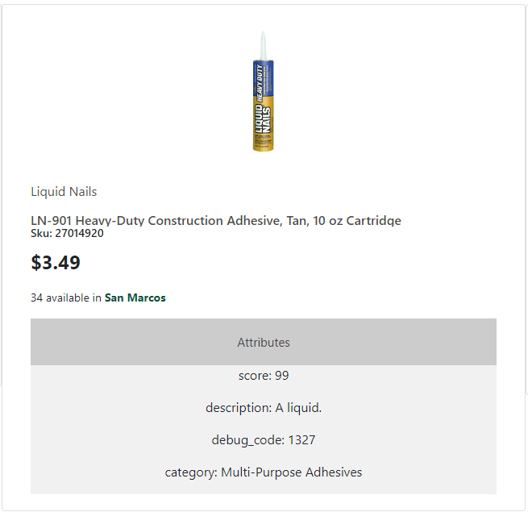

# [MCCWF] *McCoy's Web Formatter*
A solution to generate 'mccoys.com/shop'-like HTML views for entities external to McCoy's. Said solution keeps the struct/object constraints loose and does not compromise proprietary internal information.

## Quickstart!!

## Requirements:
* A valid `.json` file containing an acceptable structure (requirements/constraints below).
* The `assets` folder must be present in the same directory as the executable.
* The machine running `mccwf.exe` must have an internet connection.

## Accepted Input (and how to):
1. In your solution, create an output method or modify an existing one in to write valid JSON to-file.
>The only required key/value pair for an `items` object is *`sku`*.\
\
 
* Any data within the `attributes` object will not be operated or interpreted to assess/derive additional information. Rather, it will be passed along and formatted as-is.
* The program was not written with array or object nesting in mind.
> *If you have other values that are passable as strings but aren't actually strings, they may prevent the format from succeeding or cause unintended affects.*

| From Proper Iutput | From Improper Input |
| ----------- | ----------- |
|  |  |
  
The intention of outputting this way is to allow the solution's data to persist at the capacity its developers want it to (debugging, discovery, etc).\
\
Tip: *If you add the program's directory to your system/user environment variables for global use, you may still need to provide the program with the full path to the file you want to use (pwd works **great** here).*
